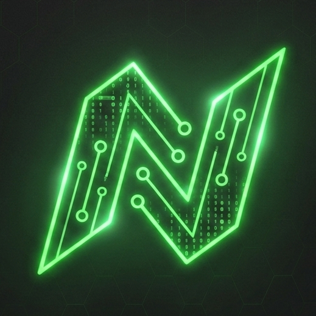

# NextMatrix

<p align="center">
  
</p>

<h3 align="center">Learn Next.js in a New Dimension</h3>

<p align="center">
  An interactive learning platform built with Next.js, featuring a structured roadmap, 
  quizzes, flashcards, code playgrounds, and progress tracking — all in a sleek 
  Matrix-inspired dark theme.
</p>

<p align="center">
  <a href="#-features">Features</a> •
  <a href="#-tech-stack">Tech Stack</a> •
  <a href="#-getting-started">Getting Started</a> •
  <a href="#-project-structure">Structure</a> •
  <a href="#-author">Author</a>
</p>

---

## Features

### Learning System
- **Structured Roadmap** — 5 phases covering HTML, CSS, JavaScript, React, and Next.js
- **47 Detailed Lessons** — In-depth explanations for every topic with code examples
- **Interactive Quizzes** — Randomized questions with scoring and pass/fail feedback
- **Flashcards** — Flip-card review system for quick knowledge reinforcement
- **Code Playgrounds** — Live code editors with real-time HTML/CSS/JS preview
- **Personal Notes** — Markdown-supported notes per topic with preview mode

### Dashboard & Progress
- **Real-time Progress Tracking** — Completion percentage, scores, and competence level
- **Performance Charts** — Visual breakdown of scores per phase using Recharts
- **LocalStorage Persistence** — Progress saves automatically across sessions
- **Unlock System** — Pass exams to unlock the next module or phase

### UI/UX
- **Dark Matrix Theme** — Neon green (#39FF14) on dark grey (#222222) with electric blue accents
- **Responsive Design** — Fully responsive sidebar and mobile navigation with Sheet component
- **Theme Toggle** — Switch between dark and light modes via next-themes
- **Smooth Animations** — Tailwind CSS transitions and Radix UI primitives

---

## Tech Stack

| Category | Technology |
|----------|------------|
| **Framework** | Next.js 15 (App Router) |
| **Language** | TypeScript |
| **Styling** | Tailwind CSS |
| **UI Components** | shadcn/ui (Radix UI primitives) |
| **State Management** | React Context API |
| **Charts** | Recharts |
| **Icons** | Lucide React |
| **Forms** | React Hook Form + Zod |
| **Theming** | next-themes |
| **Fonts** | Space Grotesk + Source Code Pro (Google Fonts) |

---

## Getting Started

### Prerequisites
- Node.js 18+ 
- npm, yarn, or pnpm

### Installation

```bash
# Clone the repository
git clone https://github.com/your-username/NextMatrix.git

# Navigate to the project
cd NextMatrix

# Install dependencies
npm install

# Start development server
npm run dev
```

The app will be available at [http://localhost:9002](http://localhost:9002)

### Available Scripts

| Command | Description |
|---------|-------------|
| `npm run dev` | Start development server with Turbopack |
| `npm run build` | Build for production |
| `npm start` | Start production server |
| `npm run lint` | Run ESLint |
| `npm run typecheck` | Run TypeScript type checking |

---

## Project Structure

```
src/
├── app/
│   ├── layout.tsx          # Root layout with metadata & providers
│   ├── page.tsx            # Home page entry point
│   └── globals.css         # Global styles & Tailwind config
├── components/
│   ├── dashboard/
│   │   ├── Dashboard.tsx       # Main dashboard with sidebar navigation
│   │   ├── RoadmapView.tsx     # Interactive roadmap with phases & modules
│   │   ├── ProgressView.tsx    # Progress dashboard with charts
│   │   ├── QuizModal.tsx       # Quiz engine with randomization
│   │   ├── FlashcardsModal.tsx # Flashcard review system
│   │   ├── Flashcard.tsx       # Animated flip card component
│   │   ├── LessonModal.tsx     # Lesson viewer with section navigation
│   │   ├── NotesModal.tsx      # Markdown notes editor
│   │   └── PlaygroundModal.tsx # Live code playground
│   └── ui/                     # shadcn/ui component library
├── contexts/
│   └── LearningContext.tsx  # Global state with localStorage persistence
├── hooks/
│   ├── use-toast.ts         # Toast notification hook
│   └── use-mobile.tsx       # Mobile detection hook
└── lib/
    ├── data.ts              # Roadmap data & type definitions
    ├── data/                # Lesson content & quiz data per technology
    │   ├── html-lessons.ts
    │   ├── css-lessons.ts
    │   ├── javascript-lessons.ts
    │   ├── react-lessons.ts
    │   ├── nextjs-lessons.ts
    │   ├── html-quiz.ts
    │   ├── css-quiz.ts
    │   ├── javascript-quiz.ts
    │   ├── react-quiz.ts
    │   ├── html-flashcards.ts
    │   ├── css-flashcards.ts
    │   ├── javascript-flashcards.ts
    │   ├── react-flashcards.ts
    │   ├── html-playgrounds.ts
    │   ├── css-playgrounds.ts
    │   ├── javascript-playgrounds.ts
    │   └── react-playgrounds.ts
    └── utils.ts             # Utility functions (cn helper)
```

---

## Architecture

### State Management
The app uses React Context API with `LearningContext` to manage all learning state:
- **Unlocked phases/modules** — Progression through the roadmap
- **Completed topics** — Topics where the user passed the exam
- **Completed lessons** — Lessons the user has read
- **Quiz scores** — Historical record of all exam attempts
- **Notes** — Per-topic markdown notes

All state persists to `localStorage` automatically.

### Learning Flow
```
1. Study Lesson → 2. Review Flashcards → 3. Practice in Playground → 4. Take Quiz → 5. Unlock Next
```

### Quiz System
- Questions are **randomly selected** from a pool of 10+ per topic
- Minimum passing score: **7/10**
- Module and phase exams use **10 random questions** from the full pool
- Topic exams use **all available questions**

---

## Author

**Your Name** — [your-email@example.com](mailto:your-email@example.com)

Project Link: [https://github.com/your-username/NextMatrix](https://github.com/your-username/NextMatrix)

---

## License

This project is open source and available under the [MIT License](LICENSE).
